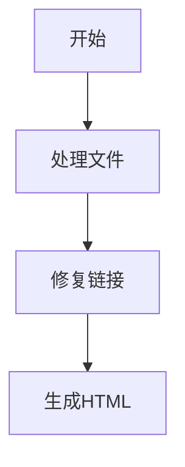

# MarkWeb - Markdown Web 编译器

> 智能的 Markdown 文档编译工具，专为现代 Web 渲染而设计

## 项目概述

MarkWeb 是一个专业的 Markdown 文档处理工具，能够自动扫描、修复文档间的链接关系，并将 Markdown 文件编译为功能丰富的 HTML 页面。工具特别针对浏览器渲染进行了优化，支持代码高亮、数学公式、图表等现代文档需求。

## 核心特性

- 🔗 **智能链接修复** - 自动检测和修复 Markdown 文件间的相对链接
- 🚀 **实时编译** - 监听文件变化，自动重新编译更新
- 🎨 **浏览器优化** - 生成针对 Web 渲染优化的 HTML
- 💡 **代码高亮** - 支持多语言语法高亮
- 📐 **数学公式** - 使用 KaTeX 渲染数学表达式
- 📊 **图表支持** - 集成 Mermaid 图表渲染
- 🌐 **开发服务器** - 内置实时预览服务器
- ⚡ **增量编译** - 智能检测变更，提升编译效率

## 安装使用

### 全局安装
```bash
npm install -g markweb
```

### 项目安装
```bash
npm install markweb --save-dev
```

## 快速开始

### 基本使用
```bash
# 编译 Markdown 文件
markweb build

# 开发模式（监听 + 实时预览）
markweb dev

# 指定输入输出目录
markweb build --input ./docs --output ./dist
```

### 配置文件 (markweb.config.js)
```javascript
module.exports = {
  input: './docs',              // 输入目录
  output: './dist',             // 输出目录
  style: 'github',              // 样式主题：default, github, minimal
  
  features: {
    codeHighlight: true,        // 代码高亮
    math: true,                 // 数学公式
    diagrams: true,             // Mermaid 图表
    toc: true,                  // 自动生成目录
    breadcrumb: true            // 面包屑导航
  },
  
  server: {
    port: 3000,                 // 开发服务器端口
    livereload: true,           // 实时刷新
    open: true                  // 自动打开浏览器
  },
  
  exclude: [                    // 排除文件模式
    'node_modules/**',
    '*.tmp.md'
  ]
};
```

## 功能详解

### 1. 智能链接处理
MarkWeb 能够自动识别和修复 Markdown 文件中的链接：

```markdown
<!-- 原始 Markdown -->
[查看配置](../config/setup.md)

<!-- 编译后 HTML -->
<a href="../config/setup.html">查看配置</a>
```

### 2. 代码高亮
支持 100+ 编程语言的语法高亮：

````markdown
```javascript
function hello() {
  console.log('Hello MarkWeb!');
}
```
````

### 3. 数学公式
使用 LaTeX 语法编写数学公式：

```markdown
行内公式：$E = mc^2$

块级公式：
$$
\int_{-\infty}^{\infty} e^{-x^2} dx = \sqrt{\pi}
$$
```

### 4. 图表支持
使用 Mermaid 语法创建图表：

````markdown

````

## API 使用

```javascript
const MarkWeb = require('markweb');

const compiler = new MarkWeb({
  input: './docs',
  output: './dist',
  style: 'github'
});

// 编译所有文件
await compiler.build();

// 监听模式
compiler.watch((event, file) => {
  console.log(`${event}: ${file}`);
});

// 启动开发服务器
compiler.serve({ port: 3000 });
```

## 命令行选项

```bash
markweb build [options]

Options:
  -i, --input <dir>      输入目录 (默认: ./docs)
  -o, --output <dir>     输出目录 (默认: ./dist)
  -c, --config <file>    配置文件路径
  -s, --style <theme>    样式主题 (default|github|minimal)
  -w, --watch            监听模式
  -p, --port <number>    开发服务器端口 (默认: 3000)
  -v, --verbose          详细输出
  -h, --help             显示帮助信息
```

## 贡献指南

欢迎提交 Issue 和 Pull Request！

1. Fork 本仓库
2. 创建特性分支 (`git checkout -b feature/amazing-feature`)
3. 提交变更 (`git commit -m 'Add amazing feature'`)
4. 推送分支 (`git push origin feature/amazing-feature`)
5. 创建 Pull Request

## 许可证

MIT License

---

**MarkWeb** - 让 Markdown 文档在 Web 上焕发生机 ✨